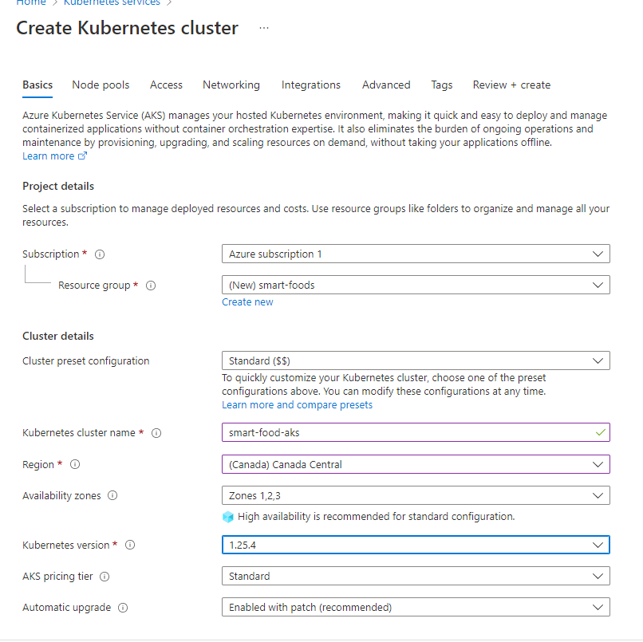
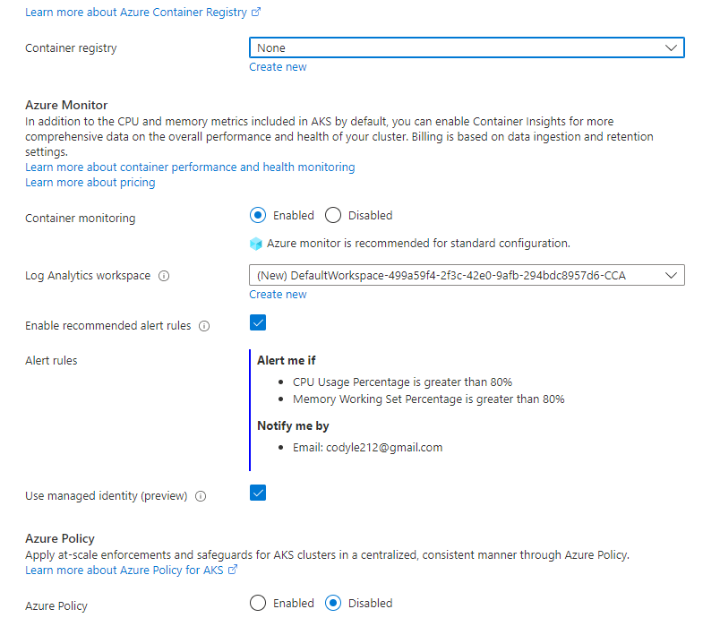
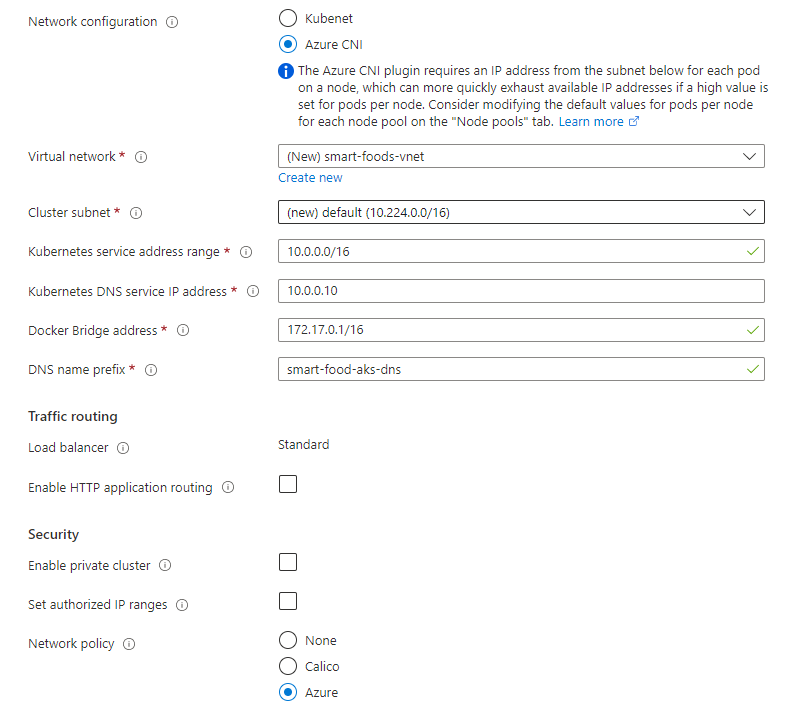
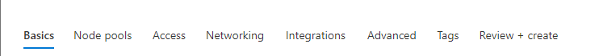
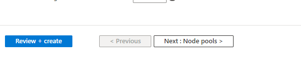
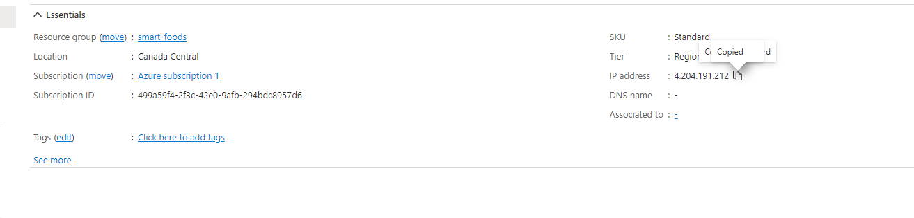

# Deployment Steps
### Step 1 Create AKS Cluster in Azure

### Step 2 Settings for AKS Cluster

- leave the rest of settings untouched

- click on review and create 

### Login to Azure
- Using Azure Cli, using `az login` to get credentials to azure
- Using Azure aks cli `az aks get-credentials --resource-group smart-foods --name smart-food-aks` to get credential for accessing the aks cluster
- the context should be set up to the aks cluster you created
### Creating a Ingress Controller
- Create new namespace with `kubectl create namespace ingress-basic`
- Create a public ip as a ingress endpoint for routing to differetn services `az network public-ip create --resource-group smart-foods --name PublicIPForIngress --sku Standard --allocation-method static --query publicIp.ipAddress -o tsv`

