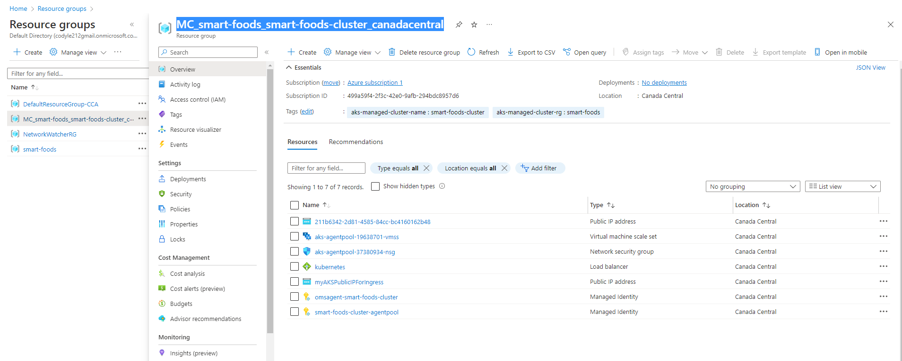
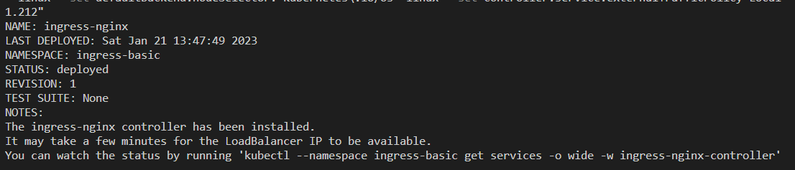

# Deployment Steps

### Step 1 Create AKS Cluster in Azure

### Step 2 Settings for AKS Cluster

-   leave the rest of settings untouched
    
-   click on review and create
    

### Login to Azure

-   Using Azure Cli, using `az login` to get credentials to azure
-   Using Azure aks cli `az aks get-credentials --resource-group smart-foods --name smart-food-aks` to get credential for accessing the aks cluster
-   the context should be set up to the aks cluster you created

### Creating a Ingress Controller

-   Create new namespace with `kubectl create namespace ingress-basic`
-   Find the Resource Group for load balancer
    
-   Create a public ip as a ingress endpoint for routing to different services `az network public-ip create --resource-group MC_smart-foods_smart-foods-cluster_canadacentral --name PublicIPForIngress --sku Standard --allocation-method static`
-   Using Helm to ingress ingress nginx and changing configs `helm install ingress-nginx ingress-nginx/ingress-nginx --namespace ingress-basic --set controller.nodeSelector."kubernetes\.io/os"=linux --set defaultBackend.nodeSelector."kubernetes\.io/os"=linux --set controller.service.externalTrafficPolicy=Local --set controller.service.loadBalancerIP="4.204.191.212"`
    
-   Create new namespace with `kubectl create namespace ingress-basic`
-   Create a public ip as a ingress endpoint for routing to differetn services `az network public-ip create --resource-group smart-foods --name PublicIPForIngress --sku Standard --allocation-method static`
    
-   Installing Ingress-Nginx controller
    
